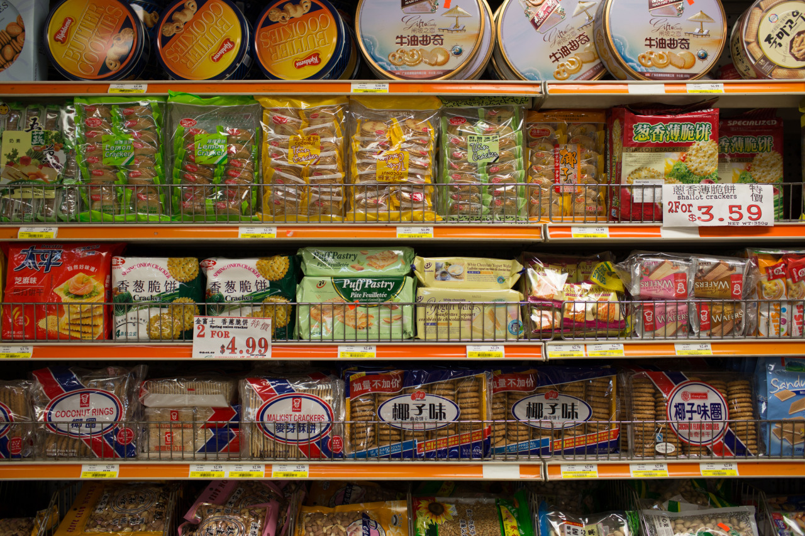

# Chinese Again

*Day 21*

After a six-hour flight, I arrived Boston to find my friend, Yeqing. In the afternoon, we ate and walked in Chinatown.

In almost every big cities in United States, there’s a Chinatown. So far, I've visited the ones in San Francisco, New York, Chicago, Seattle, Pittsburgh, and Honolulu. Then, I started to be curious about why there are so many Chinese here, and what’s their history, which pushed me to do some research online.

The first big Chinese immigrants happened in 1850s due to California Gold Rush. Nearly all of the early immigrants were young males with low educational levels from Guangdong Province. These young Chinese immigrants became labors providing the massive workforce needed to build the majority of the Central Pacific’s difficult route. They couldn't stand the poor situation back in China, and came to United States to work then send back the money to their family. In the same time, they signed contracts for being a long-term labor with no expectation for going back. However, in 1877, Chinese Exclusions happened in California due to its poor economy, and then they started to forbid immigrations from China.

The second Chinese immigrants happened in 1960s, when the immigration restrictions were eased following lots of people came here for studying then stay for work.

To sum up, we can learn that the big immigrations happened in 1850s and 1950s, which turned out that we can find Chinese communities easily in different cities here. Some of them even had stayed for tens or hundreds of years. People feel more comfortable to stay with the way they born with, which pushed Chinese people to stay together even though they are now living in United States.

---

*Chinese Market @ Boston. June 2, 2015*
