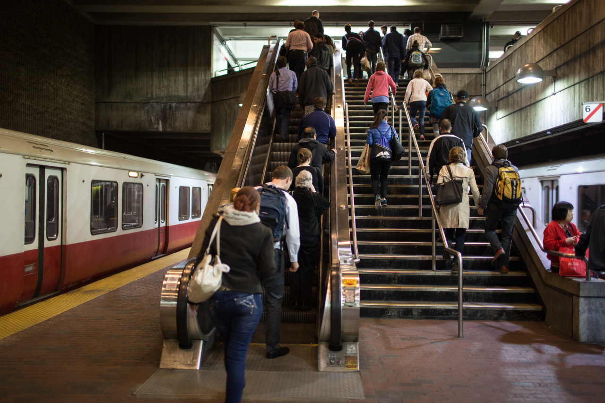

# This is Crazy

*Day 22*

"This is crazy." I said to Olive when I decided to go Portland this weekend.

Staying in Boston for 10 days sounds a little bit too long, and when I was explaining about this with Olive. She said that she went to a movie alone and didn't really have friend in Portland, then I came up with an idea is to visit Portland this weekend. It was a crazy idea since I then have to fly back to coast and fly back soon; however, I then started to think it should be worth. Instead of staying in Boston for such a long time, I should go travel as many places as I can. Then, I booked the flights and the living places soon, which will start on Friday.

This journey was long and about to end; however, instead of doing nothing and wait for the ending, I am seizing the last moments to create unforgettable memories. Passengers may pass by one station again and again, but sometimes we still lost our way. This time, I may be flying between places again and again, but I am sure this is the way I want.

---

*Boston Subway Station @ Boston. June 3, 2015*
