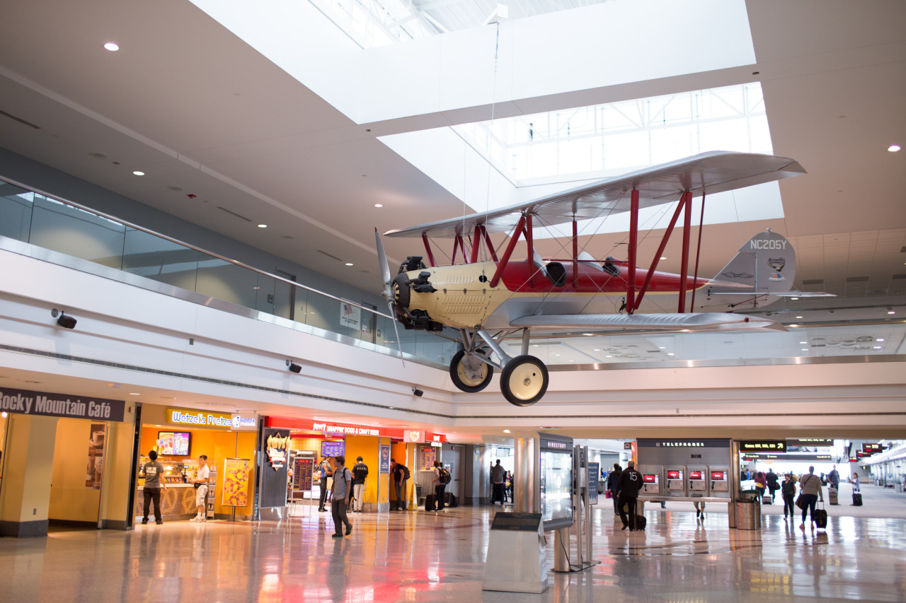

# Safe Flight

*Day 24*

"Safe flight," this is what people usually say to somebody who is about to take a flight.

My original plan changed, instead of staying in Boston, I flew to Portland to visit Olive again over the weekend. The idea sounds crazy since I was flying back and front between west and east coast for several times these days; however, I want to do this! Instead of staying in Boston for more than one week, it's more interesting hanging out with Olive, and visiting more places. Rather than sticking on original plans, I believe that following my own heart and taking more different chances are the right things to do at my age now.

"Portland is a really nice place, people are nice, and you got amazing views walking among the waterfront." the guy sat besides me on the plane said to me. I also heard from my previous roommate in Seattle saying “Portland is a great place where you can find different restaurants like Japanese, Chinese, or so on.” After hearing lots of my friends liking this place, I will definitely visit many fun places with Olive these days.

"Safe flight" she texted me before I boarded onto the plane.

---

*Denver International Airport @ Denver. June 5, 2015*
