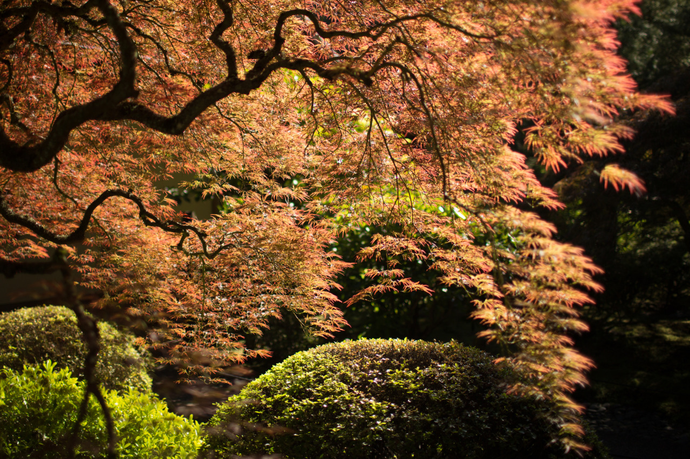

# For the Lucky and the Strong

> When the night has been too lonely
>
> And the road has been too long
>
> And you think that love is only
>
> For the lucky and the strong
>

Let's call it a day for city sightseeing. In the morning, we went to farmer market for tasty and organic food, then watch  Grand Floral Parade of their Rose Festival nearby. Afterward, we visited Chinese Garden, then tried out the food carts for Polish food and bubble tea.

While we were watching the parade, one of the cars played "The Rose" by Bette Midler loudly. In Portland, the roses are much bigger than the ones I've ever saw in Taiwan; however, like all the roses, they have scary thorns. While the roses representing love, the thorns representing that love can hurt people easily, which is so true. Like the words from the lyrics, "Love is only for the lucky and the strong," sometime we stop to believe in our own believing when we were down. However, we should never forget that every tough moment we've gone through would become something beautiful in the near future like what is said in the last few lines of the lyrics.

> Just remember in the winter
>
> Far beneath the bitter snows
>
> Lies the seed that with the sun's love
>
> In the spring becomes the rose

---

*Japanese Garden @ Portland. June 6, 2015*
