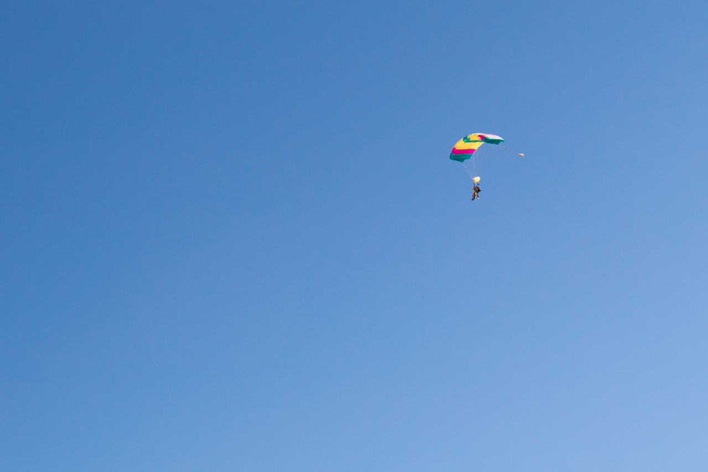

# Skydive

*Day 26*

> "Do you want to go skydiving with me?" Olive asked me.
>
> "Yes! Yes! I want to go!"

Thanks Olive. She checked out several Skydive companies in Oregon, and found out a nice one nearby. I believe that everyone should have his or her own life todo list. For me, go skydiving is the top one on my list following by taking the hot air balloon. I am glad that, finally, I made it here in Portland.

After signing the responsibility waiver form, taking a short lesson, a small airplane took us into the sky and we jumped from 10,000 feet above the ground. The whole process can be composited by three parts: freefall, flying with the parachute and landing.

Freefall means that we jumped out of the plane and flew in the sky without the parachute. The coach said the speed was around 120mph, and we had to arch our bodies in order to avoid spinning. After deploying the parachute, the speed decreased to around 15mph, which was another world for me. It was quite and slow, everything became so peaceful. The landing was relatively easy, we blended our knees, then touched the ground in the end.

This skydive experience is more than completing one of my todos, it's a thing brought me trust and courage. Even though we met the coach only for a short period of time, we trust him and followed his instructions in the sky. Also, I trust Olive that we both can do this safely and never doubt any of her decisions. Last, after we landed on the ground, I believe that I am brave enough to face any future challenge in my life no matter how tough it is.

---

*Skydive Eagle Creek @ Oregon. June 7, 2015*
