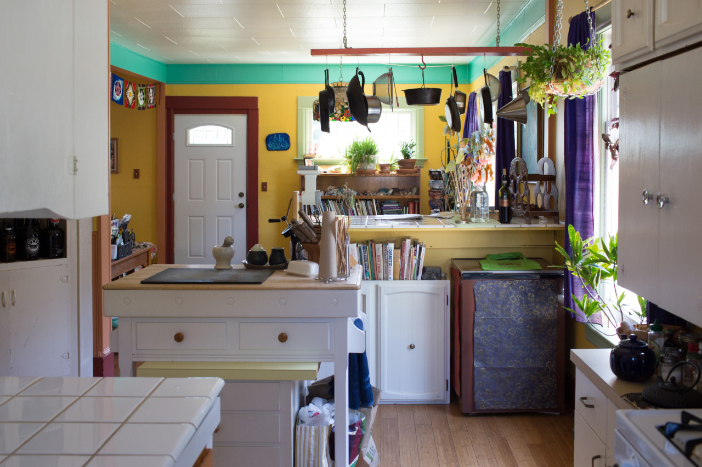

# Home is Everywhere

*Day 27*

"Feel free to hang out downstairs" my Airbnb host told me when I arrived.

Generally, there are three types of accommodation for travelling around United States: hostel, Airbnb, and hotel. Hostel is the cheapest and also a place to meet people. Most of time, you book a shared room and meet people from different cities or countries. Airbnb is a new style of accommodation which became pretty famous these years. The host may have extra space in his or her house, then he or she let the traveler to stay in that place. All the procedure was done on Airbnb website or mobile application, which means that you can do the reservation easily by simply clicks. For hotel, I believe most people know what it is, and it’s the most expensive option comparing to others.

To make a Airbnb reservation, you first clicked on request button on their page. Then, the host will contact you via email or Airbnb instant messaging. After we both are okay with the staying plan, the host will click on confirm button then everything was done. When I arrive there, and the host will either wait there for me to check-in or just leave the door key somewhere.

The first day I arrived my Portland Airbnb, the host treated me really nice. He gave a free space, and made me feel like going back to home. He also showed me the chicken he feeds. He told me that there are six chicken in the back yard, and each of them lay one egg everyday. So, he can get six eggs everyday. He cares about the environment, prefer nature food, and believe that there’s a circulation between human beings and the environment. Comparing to the days living in cities, I realized how important it is to care about the environment, and how beautiful our environment is.

---

*De & Toby Airbnb @ Portland. June 8, 2015*
