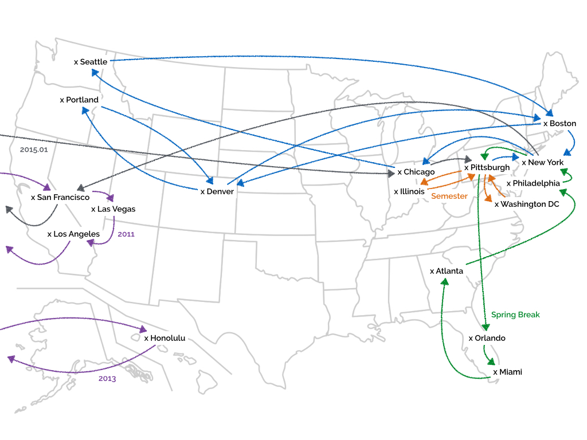

# End? No

> "So, is your story going to end here?" my friends asked.
>
> "No! But, it's time to move on for the next chapter."

It's been a really long trip, and I appreciate every single person I met during the trip for being amazing. I was trying to list out all the people to thank in this paragraph, but I failed. There are way too many, and to list all of them, I may need tens of pages. They all treated my super nice. Without these friends, I couldn't visit that many places, couldn't gone through all the difficulties, and couldn't write all these happy stories.

Before the trip, I set up the goal of this journey. Although I got lost and confused sometime, I always remember those original intentions, which are "Be humble and learn", "Open, and talk with people", and "Observe and think." In the end of this trip, I realize that I am much stronger and brave enough to face any future challenges, which is not because I studied a lot or some boring answers, but because I've met so many interesting and smart people. They've taught me words of wisdom and stayed besides me in my hard times. Again, I really appreciate it.

Don't be sad, my story is not going to end here. Though the pages in one book is limited, my life is still young. It's time to move on, and I am looking forward future challenges. With friends and these stories, I am, for sure, ready for the next journey.
